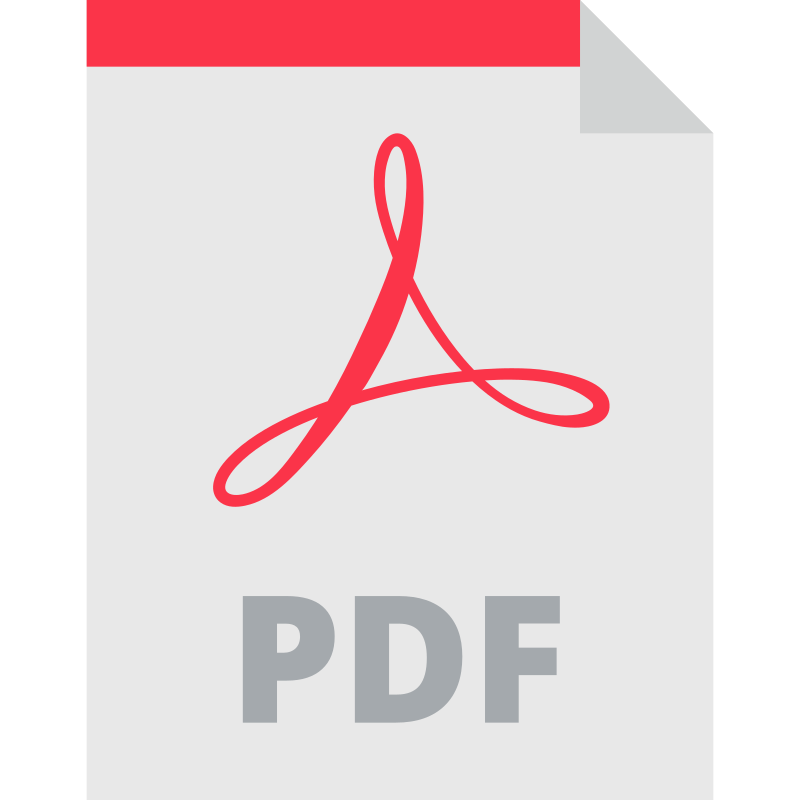

# The Motoko Programming Language

Last updated: 2023-06-17

<a href="/print.html">
Download v1.0

</a>  
  
  
  

## Links

[GitHub Repo](https://github.com/Web3NL/motoko-book)

[Official Motoko Docs](https://internetcomputer.org/docs/current/developer-docs/build/cdks/motoko-dfinity/motoko/)  
[Official Base Library Reference](https://internetcomputer.org/docs/current/references/motoko-ref/)  
[Official ICRC1 Docs](https://internetcomputer.org/docs/current/developer-docs/integrations/icrc-1/)

## Author

_Written by [@SamerWeb3](https://twitter.com/SamerWeb3)_

_Special thank you to OpenAI's ChatGPT for helping me learn quickly and assisting me with writing this text!_

**"Democratize access to the tech economy and make everyone industrious"**  
~Dominic Williams
